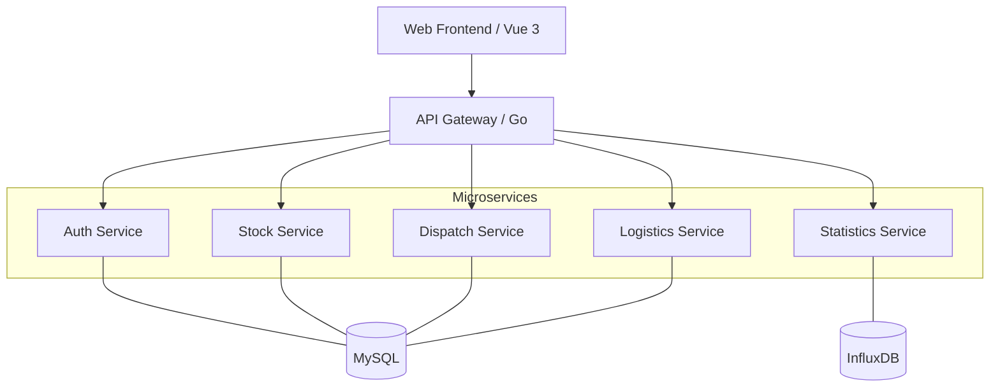

# 应急物资管理系统 (Emergency Material Management System)

[](LICENSE)
[](https://golang.org)
[](https://vuejs.org)

## 🌟 项目综述

本项目是一个全栈式的应急物资调度与管理平台，旨在提高灾害发生时的物资协调效率。系统采用微服务架构，前端使用 Vue 3 提供直观的指挥界面，后端基于 Go 语言构建高性能的微服务集群。

### 核心功能模块

*   **📦 物资与库存管理**: 实时监控多仓库库存、支持入库、出库及跨库调配。
*   **⚖️ 需求调度指挥**: 自动分配建议、需求审批流、紧急程度分级。
*   **📍 物流追踪中心**: 基于高德地图 API 的实时运输轨迹追踪。
*   **📊 统计分析大屏**: 多维度的物资分发趋势、库存预警与动态看板。
*   **🛡️ 统一认证与鉴权**: 基于 JWT 的 RBAC 权限控制，支持管理员、仓管员、救援员角色。

## 🏗️ 系统架构



## 🚀 快速启动

### 环境准备
- Go 1.24+
- Node.js 18+
- Docker & Docker Compose
- 高德地图 API Key (配置在 `frontend/app/.env`)

### 一键部署 (Docker)
```bash
make deploy-all
```

### 本地开发模式

#### 后端启动
```bash
cd backend
go work init
go work use ./internal/common ./internal/auth ./internal/stock ./internal/dispatch ./internal/logistics ./internal/statistics
# 启动各服务
make build-bin
# 启动数据库
make deploy-up
```

#### 前端启动
```bash
cd frontend
make install
make run
```

## 📂 项目结构

```text
.
├── backend/                # 后端微服务 (Go)
│   ├── api/                # OpenAPI & Protobuf 定义
│   ├── cmd/                # 入口程序 (Gateway)
│   ├── internal/           # 核心业务逻辑
│   ├── migrations/         # 数据库迁移脚本
│   └── deploy/             # Docker/K8s 部署配置
├── frontend/               # 前端应用 (Vue 3 + TS)
│   ├── app/                # 源码目录
│   └── makefile            # 前端构建脚本
├── makefile                # 根目录统一管理脚本
└── README.md
```

## 🛠️ 技术栈清单

- **前端**: Vue 3, Vite, Element Plus, Pinia, Tailwind CSS, ECharts, AMap SDK.
- **后端**: Golang, Gin, GORM, gRPC, Viper, Zap, Prometheus.
- **数据**: MySQL 8.0, InfluxDB, Grafana.

## 🤝 贡献说明

1. 创建特性分支.
2. 提交代码并确保 Lint 通过.
3. 提交 PR 并关联任务 ID.

---
Designed with ❤️ for Emergency Management.
